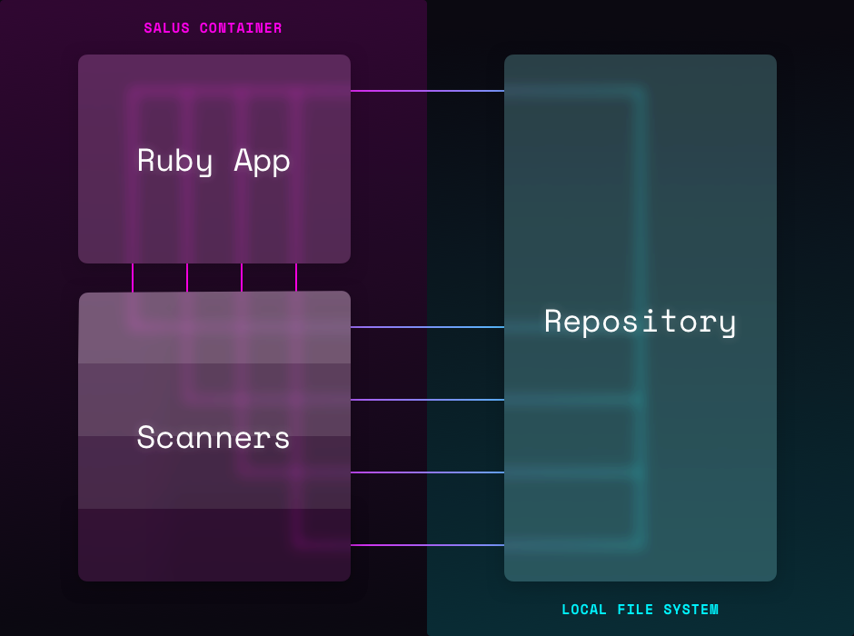

# Salus Architecture

Salus is a docker container. Installed into the container are security scanners and a small ruby application that coordinates them.

The source code being scanned is volumed into the container and Salus expects to find this code at the internal path `/home/repo`. While the Salus application is written in Ruby, other languages are installed in the container as required for each scanners.

## Ruby Objects

  - [`Salus`](../lib/salus.rb): the primary class of the application.
  - [`Salus::CLI`](../lib/salus/cli.rb): command line wrapper to run Salus.
  - [`Salus::Config`](../lib/salus/config.rb): object that maintains Salus' configuration.
  - [`Salus::Processor`](../lib/salus/processor.rb): runs each scanners against the repo.
  - [`Salus::Repo`](../lib/salus/repo.rb): representation of the repository being scanned.
  - [`Salus::Report`](../lib/salus/report.rb): object that collects data about scans and compiles a report.
  - [`Salus::Scanners::<name>`](../lib/salus/scanners): scanner objects that can determine if a scanner should run, runs the scanner and collect the results.
